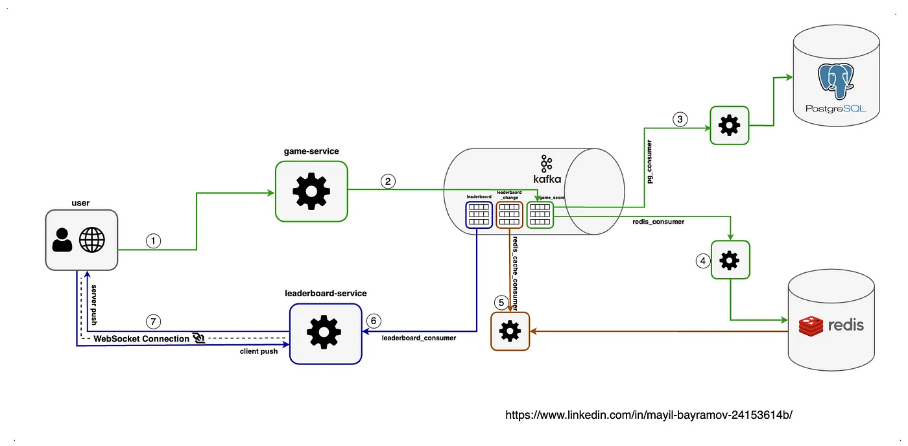

# real-time-leader-board

https://medium.com/@mayilb77/design-a-real-time-leaderboard-system-for-millions-of-users-08b96b4b64ce  
I followed the techniques outlined in this article.

# How to run
1. docker-compose -f ./docker/docker-compose.yml up -d
2. run all modules
3. visit http://localhost:8084/leaderboard
